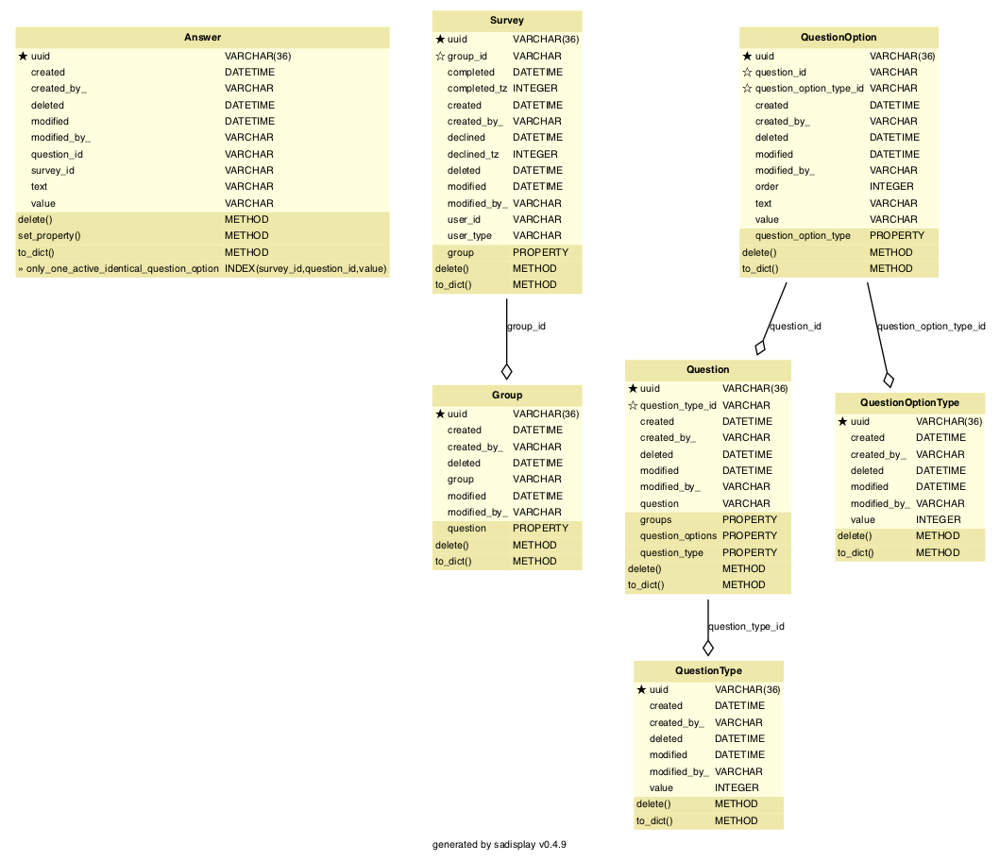

<!-- Title - A concise title for the service that fits the pattern identified and in use across all services. -->
# Polaris Questions API

[](https://github.com/ambv/black)

<!-- Description - Fewer than 500 words that describe what a service delivers, providing an informative, descriptive, and comprehensive overview of the value a service brings to the table. -->
The Questions API is part of the Polaris platform (formerly DHOS). This service is for managing survey style questions and answers.

## Maintainers
The Polaris platform was created by Sensyne Health Ltd., and has now been made open-source. As a result, some of the
instructions, setup and configuration will no longer be relevant to third party contributors. For example, some of
the libraries used may not be publicly available, or docker images may not be accessible externally. In addition, 
CICD pipelines may no longer function.

For now, Sensyne Health Ltd. and its employees are the maintainers of this repository.

## Setup
These setup instructions assume you are using out-of-the-box installations of:
- `pre-commit` (https://pre-commit.com/)
- `pyenv` (https://github.com/pyenv/pyenv)
- `poetry` (https://python-poetry.org/)

You can run the following commands locally:
```bash
make install  # Creates a virtual environment using pyenv and installs the dependencies using poetry
make lint  # Runs linting/quality tools including black, isort and mypy
make test  # Runs unit tests
```

You can also run the service locally using the script `run_local.sh`, or in dockerized form by running:
```bash
docker build . -t <tag>
docker run <tag>
```

## Documentation
<!-- Include links to any external documentation including relevant ADR documents.
     Insert API endpoints using markdown-swagger tags (and ensure the `make openapi` target keeps them up to date).
     -->

<!-- markdown-swagger -->
 Endpoint                                                        | Method | Auth? | Description                                                                                                                                                                                        
 --------------------------------------------------------------- | ------ | ----- | ---------------------------------------------------------------------------------------------------------------------------------------------------------------------------------------------------
 `/running`                                                      | GET    | No    | Verifies that the service is running. Used for monitoring in kubernetes.                                                                                                                           
 `/version`                                                      | GET    | No    | Get the version number, circleci build number, and git hash.                                                                                                                                       
 `/dhos/v1/question_type`                                        | POST   | Yes   | Create a new question type using the details provided in the request body.                                                                                                                         
 `/dhos/v1/question_option_type`                                 | POST   | Yes   | Create a new question option type using the details provided in the request body.                                                                                                                  
 `/dhos/v1/question`                                             | POST   | Yes   | Create a new question using the details provided in the request body.                                                                                                                              
 `/dhos/v1/survey`                                               | POST   | Yes   | Create a new survey using the details provided in the request body.                                                                                                                                
 `/dhos/v1/survey`                                               | GET    | Yes   | Get a list of all surveys.                                                                                                                                                                         
 `/dhos/v1/answer`                                               | POST   | Yes   | Create a new answers using the array of objects provided in the request body.                                                                                                                      
 `/dhos/v1/answer`                                               | GET    | Yes   | Get all answers for all surveys. Responds with an array of answer objects.                                                                                                                         
 `/dhos/v1/survey/{survey_uuid}/answer`                          | POST   | Yes   | Create new answers for a particular survey using the array of objects provided in the request body.                                                                                                
 `/dhos/v1/survey/{survey_uuid}/answer`                          | GET    | Yes   | Get answers for the survey with the provided UUID. Responds with an array of answers.                                                                                                              
 `/dhos/v1/question/{question_uuid}`                             | GET    | Yes   | Get the question that matches the UUID provided in the URL path.                                                                                                                                   
 `/dhos/v1/survey/{survey_uuid}/question`                        | GET    | Yes   | Get a list of all the questions belonging to the survey that matches the UUID provided in the URL path.                                                                                            
 `/dhos/v1/group/{group_uuid}/question`                          | GET    | Yes   | Get a list of all the questions belonging to the group that matches the UUID provided in the URL path.                                                                                             
 `/dhos/v1/survey/{survey_uuid}`                                 | GET    | Yes   | Get the survey that matches the UUID provided in the URL path.                                                                                                                                     
 `/dhos/v1/survey/{survey_uuid}`                                 | PATCH  | Yes   | Update a survey by UUID with the details provided in the request body                                                                                                                              
 `/dhos/v1/survey/{survey_uuid}/question/{question_uuid}/answer` | GET    | Yes   | Get answers for the survey and question with the provided UUIDs. Responds with an array of answers.                                                                                                
 `/dhos/v1/answer/{answer_uuid}`                                 | GET    | Yes   | Get a particular answer by UUID                                                                                                                                                                    
 `/dhos/v1/answer/{answer_uuid}`                                 | PATCH  | Yes   | Update an answer by UUID using the answer details provided in the request body.                                                                                                                    
 `/dhos/v1/survey_responses`                                     | GET    | Yes   | Generates and returns a CSV of survey questions and answers between two dates. The dates are inclusive - if an end_date is specified then any survey answers recorded on that day will be included.
<!-- /markdown-swagger -->

## Requirements
<!-- An outline of what other services, tooling, and libraries needed to make a service operate, providing a
  complete list of EVERYTHING required to work properly. -->
  At a minimum you require a system with Python 3.9. Tox 3.20 is required to run the unit tests, docker with docker-compose are required to run integration tests. See [Development environment setup](https://sensynehealth.atlassian.net/wiki/spaces/SPEN/pages/3193270/Development%2Benvironment%2Bsetup) for a more detailed list of tools that should be installed.
  
## Deployment
<!-- Setup - A step by step outline from start to finish of what is needed to setup and operate a service, providing as
  much detail as you possibly for any new user to be able to get up and running with a service. -->
  
  All development is done on a branch tagged with the relevant ticket identifier.
  Code may not be merged into develop unless it passes all CircleCI tests.
  :partly_sunny: After merging to develop tests will run again and if successful the code is built in a docker container and uploaded to our Azure container registry. It is then deployed to test environments controlled by Kubernetes.

## Testing
<!-- Testing - Providing details and instructions for mocking, monitoring, and testing a service, including any services or
  tools used, as well as links or reports that are part of active testing for a service. -->

### Unit tests
:microscope: Either use `make` or run `tox` directly.

<!-- markdown-make Makefile tox.ini -->
`tox` : Running `make test` or tox with no arguments runs `tox -e lint,default`

`make clean` : Remove tox and pyenv virtual environments.

`tox -e debug` : Runs last failed unit tests only with debugger invoked on failure. Additional py.test command line arguments may given preceded by `--`, e.g. `tox -e debug -- -k sometestname -vv`

`make default` (or `tox -e default`) : Installs all dependencies, verifies that lint tools would not change the code, runs security check programs then runs unit tests with coverage. Running `tox -e py39` does the same but without starting a database container.

`tox -e flask` : Runs flask within the tox environment. Pass arguments after `--`. e.g. `tox -e flask -- --help` for a list of commands. Use this to create database migrations.

`make help` : Show this help.

`make lint` (or `tox -e lint`) : Run `black`, `isort`, and `mypy` to clean up source files.

`make openapi` (or `tox -e openapi`) : Recreate API specification (openapi.yaml) from Flask blueprint

`make pyenv` : Create pyenv and install required packages (optional).

`make readme` (or `tox -e readme`) : Updates the README file with database diagram and commands. (Requires graphviz `dot` is installed)

`make test` : Test using `tox`

`make update` (or `tox -e update`) : Updates the `poetry.lock` file from `pyproject.toml`

<!-- /markdown-make -->

## Integration tests
:nut_and_bolt: Integration tests are located in the `integration-tests` sub-directory. After changing into this directory you can run the following commands:

<!-- markdown-make integration-tests/Makefile -->
<!-- /markdown-make -->

## Database migrations
Any changes affecting the database schema should be reflected in a database migration. Simple migrations may be created automatically:

```$ tox -e flask -- db migrate -m "some description"```

More complex migration may be handled by creating a migration file as above and editing it by hand.
Don't forget to include the reverse migration to downgrade a database.

## Configuration
<!-- Configuration - An outline of all configuration and environmental variables that can be adjusted or customized as part
  of service operations, including as much detail on default values, or options that would produce different known
  results for a service. -->
  * `DATABASE_USER, DATABASE_PASSWORD,
   DATABASE_NAME, DATABASE_HOST, DATABASE_PORT` configure the database connection.
  * `LOG_LEVEL=ERROR|WARN|INFO|DEBUG` sets the log level
  * `LOG_FORMAT=colour|plain|json` configure logging format. JSON is used for the running system but the others may be more useful during development.
  
## Database
Questions and answers are stored in a Postgres database.

<!-- Rebuild this diagram with `make readme` -->


## Overview

When feedback is required a new survey is created. A survey is an instance of a question group. A question group is a series of questions to be answered. An individual user will submit answers under a specific survey.

This allows the same group of questions to be asked multiple times, they will be the same group of questions appearing under different surveys.

Questions are designed to provide enough information to allow for a form based user interface to be presented for the purpose of providing an appropriate answer.

## Questions

Questions are split into the following models:

* question
* question_type
* question_options
* groups

A question is a resusable single question. It contains its identifier and its question. It has a type which is a fixed list of types.

### Question types

* 0 - free text
* 1 - integer
* 2 - checkbox
* 3 - radio
* 4 - drop down
* 5 - range
* 6 - multi-select

The question types are divided into the common web based form types to allow relatively direct translation to UI elements.

Depending on the question_type it may have 0 or more question_options.

### Question options

Question options are linked to question types 2 - 6. They allow for identifying the range of valid answers to a question. Question options also have question option types

### Question option types

* 0 - fixed
* 1 - free text
* 2 - range start
* 3 - range end
* 4 - interval

The question option types allow for varied forms of options, such as a free text entry for a radio button selection and which components are the maximum and minimum for ranges.

## Surveys

Surveys are instances of question groups and are connected directly to a user_id. They allow for multiple groups of questions to be assigned to the same user as each survey is unique but allows the re-use of question groups.

## Answers

Answers relate to a survey id and a question id. They allow for the same question to be answered by the same unique user across multiple surveys. A potential use case for this would be GDM end of pregnancy application feedback for an end user across multiple pregnancies.

When answers are submitted they are always submitted in batches even if it is only a single answer to a question with a singular answer type.

Multiple answers can be supplied to the same question for the case of checkboxes and multi-select to indicate which of the multiple options have been selected. Other question types can only have one answer per question per survey.

Answers cannot be overwritten and require the deletion of the current answer before re-submitting a new answer.

When answers are submitted by survey id, the completion date is set on the related survey. It is possible to submit another batch, which will update the completion date. i.e. you could answer questions 1-5 of 10 in one batch and 6-10 in another batch. The first batch would trigger a completion date to be set, the second batch would overwrite the completion date. The expecatation is that this method is used by phone apps to submit answers in one batch. In order to maintain synchronisation of date between phone and server more easily the survey is simulataneously updated on a successfully posting of the answers.
